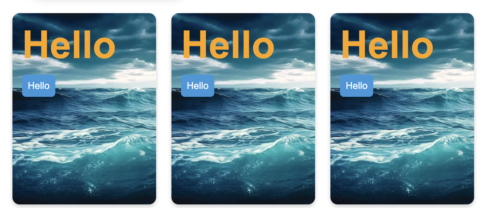

# ZoomCard

To use image as background for the entire card use the ```ZoomCard``` element with a background. To create entire grid with these cards, use the following operator:

```js
let els = [
	{ 	// designerTest/components/CardGetter
        type: "cards",
        children: ["text", "image", "link"],
        backgroundCard: true // 9:01:25 saw it again 27/11/24
	}
];
```


This generates ```FlexGrid``` with ```ZoomCard``` structure.
The ```inpad``` property sets the inner padding.

//182501 images

```js
 new FlexGrid()
 	.set({
 		colat: "700px",
 		wrap: true,
 		align: "center"
 	})
 	.items([
        new ZoomCard().set({
 			url: "https://img.freepik.com/free-photo/seascape-texture-waves-water-generative-ai_169016-30500.jpg",
 			font: "Arial",
 			arrayMargin: {
 				sides: ["all"],
 				value: "0.8rem"
 			},
 			inpad: "1rem",
 			useBrightness: true
 		})
 		.items([

 			new Text("Hello").set({
 				fluidc: "S3",
 				color: "orange",
 				id: "#L"
 			}),
 			new Link("Link").set({
 				text: "Hello",
 				url: "#a",
 				id: "#L",
 				background: "#3498db",
 				arrayPadding: {
 					sides: ["all"],
 					value: "0.6rem"
 				},
 				arrayMargin: {
 					sides: ["top", "bottom"],
 					value: "0.8rem"
 				},
 				radius: "0.4rem",
 				color: "white"
 			}),
 		]),
		 new ZoomCard().set({
 			url: "https://img.freepik.com/free-photo/seascape-texture-waves-water-generative-ai_169016-30500.jpg",
 			font: "Arial",
 			arrayMargin: {
 				sides: ["all"],
 				value: "0.8rem"
 			},
 			inpad: "1rem",
 			useBrightness: true
 		})
 		.items([

 			new Text("Hello").set({
 				fluidc: "S3",
 				color: "orange",
 				id: "#L"
 			}),
 			new Link("Link").set({
 				text: "Hello",
 				url: "#a",
 				id: "#L",
 				background: "#3498db",
 				arrayPadding: {
 					sides: ["all"],
 					value: "0.6rem"
 				},
 				arrayMargin: {
 					sides: ["top", "bottom"],
 					value: "0.8rem"
 				},
 				radius: "0.4rem",
 				color: "white"
 			}),
 		]),
		 new ZoomCard().set({
 			url: "https://img.freepik.com/free-photo/seascape-texture-waves-water-generative-ai_169016-30500.jpg",
 			font: "Arial",
 			arrayMargin: {
 				sides: ["all"],
 				value: "0.8rem"
 			},
 			inpad: "1rem",
 			useBrightness: true
 		})
 		.items([

 			new Text("Hello").set({
 				fluidc: "S3",
 				color: "orange",
 				id: "#L"
 			}),
 			new Link("Link").set({
 				text: "Hello",
 				url: "#a",
 				id: "#L",
 				background: "#3498db",
 				arrayPadding: {
 					sides: ["all"],
 					value: "0.6rem"
 				},
 				arrayMargin: {
 					sides: ["top", "bottom"],
 					value: "0.8rem"
 				},
 				radius: "0.4rem",
 				color: "white"
 			}),
 		]),
 	])
 	.render("#mount");
```


