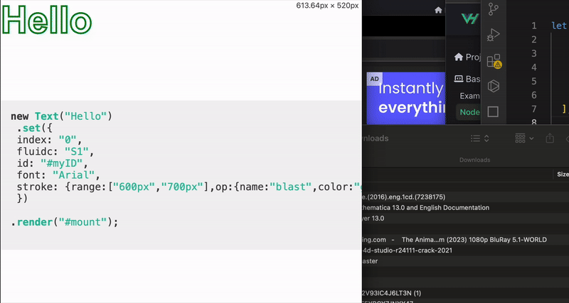

# Getting started 
 This library works with *elements* represented as an array of HTML entities, and *nodes* that control the behaviour of elements.

**Elements** are automatically responsive pieces of code the produce code that renders structure of user interface. 

**Nodes** change the look and behavior of elements.

Let's walk through the app creation process step-by-step. There is also interactive playground at the [bottom](#demo) of this page.

### Installation
The fastest way to get started is to use the NodeJS.

```js
npm create nodality@latest my-app
```

### Step 1 
Define array of **elements** you want to display in your user interface.

```js
let elements = [
    {
        type: "h1",
        text: "Hello"
    }
];
```

### Step 2
Define array of **nodes** that will adjust behaviour of the element. This particular node will add the stroked text effect.

```js
let nodes = [
    {
       op: "blast"
    }
];
```

### Step 3
Add ```nodes``` array into ```.nodes``` modifier, and use ```.set``` method to mount the result of the code to the website.
Use ```code: true``` option to also display the code of the elements.

```js
new Des()
    .nodes(nodes)
    .add(elements)
    .set({
        mount: "#mount",
        code: true
    });
```
Also define div with id ```#mount``` that will serve as a root to render the UI.


## Everything together
Here is the entire code:

```html
<!--div for mounting the result-->
<div id="#mount"></div>

<script type="module">
import {Des} from "https://www.unpkg.com/nodality@1.0.0-beta.4/dist/index.esm.js";

let elements = [
    {
        type: "h1",
        text: "Hello"
    }
];


let nodes = [
    {
       op: "blast"
    }
];


new Des()
    .nodes(nodes)
    .add(elements)
    .set({
        mount: "#mount",
        code: true
    });
</script>
```


After running this code, you will see ```h1``` element on the screen. When the user resizes window anf hits the breakpoint 400 - 600px the text stroke effect will appear thanks to stroke modifier.

User will also see the resulting code.





```js
, new Text("Hello")
 .set({
 index: "0",
 fluidc: "S1",
 font: "Arial",
 stroke: {op:{name:"blast",color:"green",width:"1px"}}, 
 })
 
.render("#mount"); 

```
You can then render this generated element directly in new empty HTML file. 
Use the ```render``` method, where ```#mount``` is a ```div``` element that will be used to render the ```Text``` class.

```html


<!--div for mounting the result-->
<div id="#mount"></div>

<script type="module">
import {Des} from "https://www.unpkg.com/nodality@1.0.0-beta.4/dist/index.esm.js";

new Text("Hello")
 .set({
 index: "0",
 fluidc: "S1",
 font: "Arial",
 stroke: {op:{name:"blast",color:"green",width:"1px"}}, 
 })
.render("#mount");
</script>
```


<!---
<iframe width="100%" height="600px" src="https://stackblitz.com/edit/stackblitz-starters-xqzqqm?embed=1&file=index.html"></iframe>
-->


<!---DEVBOX---
<iframe src="https://codesandbox.io/p/devbox/simple-q84g9f?embed=1&file=%2Findex.html"
     style="width:100%; height: 500px; border:0; border-radius: 4px; overflow:hidden;"
     title="simple"
     allow="accelerometer; ambient-light-sensor; camera; encrypted-media; geolocation; gyroscope; hid; microphone; midi; payment; usb; vr; xr-spatial-tracking"
     sandbox="allow-forms allow-modals allow-popups allow-presentation allow-same-origin allow-scripts"
   ></iframe>
   --->

See the demo below:
<!---

<iframe
  src="https://codesandbox.io/embed/new?codemirror=1"
  style="width:100%; height:500px; border:0; border-radius: 4px; overflow:hidden;"
  allow="accelerometer; ambient-light-sensor; camera; encrypted-media; geolocation; gyroscope; hid; microphone; midi; payment; usb; vr; xr-spatial-tracking"
  sandbox="allow-forms allow-modals allow-popups allow-presentation allow-same-origin allow-scripts"
></iframe>
-->
<!---
<div id="container"></div>
<component is="script">
livecodes.createPlayground('#container', {
    params: {
      markdown: '# Hello LiveCodes!',
      css: 'h1 {color: dodgerblue;}',
      js: 'console.log("Hello, from JS!");',
      console: 'open',
    },
  });
</component>

--->
  

<!--
<iframe style="width: 100%; height: 300px" src="https://jsfiddle.net/JonAbrams/2MWDC/" allowfullscreen="allowfullscreen" frameborder="0"></iframe>
--->


<!---1500 CZK per year is OK--->


<!---
<iframe src="https://codesandbox.io/embed/4yxllr?view=editor+%2B+preview&module=%2Fsrc%2Findex.js"
     style="width:100%; height: 500px; border:0; border-radius: 4px; overflow:hidden;"
     title="blazing-smoke"
     allow="accelerometer; ambient-light-sensor; camera; encrypted-media; geolocation; gyroscope; hid; microphone; midi; payment; usb; vr; xr-spatial-tracking"
     sandbox="allow-forms allow-modals allow-popups allow-presentation allow-same-origin allow-scripts"
   ></iframe>
--->

<!---SANBOX + COPY EMBED CODE-
<iframe src="https://codesandbox.io/embed/937tz4?view=editor+%2B+preview&module=%2Fsrc%2Findex.html"
     style="width:100%; height: 500px; border:0; border-radius: 4px; overflow:hidden;"
     title="blazing-smoke (forked)"
     allow="accelerometer; ambient-light-sensor; camera; encrypted-media; geolocation; gyroscope; hid; microphone; midi; payment; usb; vr; xr-spatial-tracking"
     sandbox="allow-forms allow-modals allow-popups allow-presentation allow-same-origin allow-scripts"
   ></iframe>--->
<!--
<iframe height="300" style="width: 100%;" scrolling="no" title="Untitled" src="https://codepen.io/filipvabrousek/embed/NPWYvQv?default-tab=html%2Cresult" frameborder="no" loading="lazy" allowtransparency="true" allowfullscreen="true">
  See the Pen <a href="https://codepen.io/filipvabrousek/pen/NPWYvQv">
  Untitled</a> by Filip Vabrousek (<a href="https://codepen.io/filipvabrousek">@filipvabrousek</a>)
  on <a href="https://codepen.io">CodePen</a>.
</iframe>
--->
## Demo

<!---
<iframe height="800px" style="width: 100%" src="https://stackblitz.com/edit/stackblitz-starters-wukw8wp6?embed=1&file=source.js"></iframe>--->

<!---USe Stackblitz in Incognito so you won't edit your files-->
<!---share => embed just simple iframe and paste URL--->

<!---make cool simple website before documentation?----->
<!---uper HALF clean--->

<!---
<iframe height="300" style="width: 100%" 
src="https://stackblitz.com/edit/stackblitz-starters-4xgawhpa?embed=1&file=index.html"></iframe>
---->


<iframe loading="lazy" height="300" width="100%" 
src="https://stackblitz.com/edit/stackblitz-starters-aebrgagx?embed=1&file=index.html"></iframe>

<!----174252 Nice it works!!!--->
