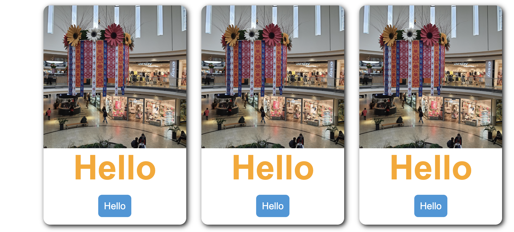

# Card
Create ```Card``` elements containing ```Image```, ```Text``` and ```Link``` elements.

If we supply elements into the ```children``` property, the respective elements are created.

* ```image``` - ```new Image...```  
* ```text``` - ```new Text...```  
* ```link``` - ```new Link...```  
```js
let elements = [
  {
    type: "cards",
    children: ["image", "text", "link"]
  }
];
```




This operation results in this code.
```js
 new FlexGrid()
	.set({
		colat: "700px",
		wrap: true,
		align: "center"
	})
	.items([
		new Card()
		.set({
			border: "1px solid green",
			width: "300px",
			radius: "0.7rem",
			mar: {
				sides: ["all"],
				value: "0.8rem"
			}
		})
		.items([
			new Image("https://lh3.googleusercontent.com/p/AF1QipNJXDyD3KTBYXHx37lplAtUYnUgFC9ymYmObtGJ=s1360-w1360-h1020").set({}),
			new Text("Hello").set({
				fluidc: "S3",
				color: "orange"
			}),
			new Link("Link").set({
				text: "Hello",
				url: "#a",
				background: "#3498db",
				pad: {
					sides: ["all"],
					value: "0.6rem"
				},
				mar: {
					sides: ["top", "bottom"],
					value: "0.8rem"
				},
				radius: "0.4rem",
				color: "white"
			})
		]), new Card()
		.set({
			border: "1px solid green",
			width: "300px",
			radius: "0.7rem",
			mar: {
				sides: ["all"],
				value: "0.8rem"
			}
		})
		.items([
			new Image("https://lh3.googleusercontent.com/p/AF1QipNJXDyD3KTBYXHx37lplAtUYnUgFC9ymYmObtGJ=s1360-w1360-h1020").set({}),
			new Text("Hello").set({
				fluidc: "S3",
				color: "orange"
			}),
			new Link("Link").set({
				text: "Hello",
				url: "#a",
				background: "#3498db",
				pad: {
					sides: ["all"],
					value: "0.6rem"
				},
				mar: {
					sides: ["top", "bottom"],
					value: "0.8rem"
				},
				radius: "0.4rem",
				color: "white"
			})
		]), new Card()
		.set({
			border: "1px solid green",
			width: "300px",
			radius: "0.7rem",
			mar: {
				sides: ["all"],
				value: "0.8rem"
			}
		})
		.items([
			new Image("https://lh3.googleusercontent.com/p/AF1QipNJXDyD3KTBYXHx37lplAtUYnUgFC9ymYmObtGJ=s1360-w1360-h1020").set({}),
			new Text("Hello").set({
				fluidc: "S3",
				color: "orange"
			}),
			new Link("Link").set({
				text: "Hello",
				url: "#a",
				background: "#3498db",
				pad: {
					sides: ["all"],
					value: "0.6rem"
				},
				mar: {
					sides: ["top", "bottom"],
					value: "0.8rem"
				},
				radius: "0.4rem",
				color: "white"
			})
		])
	])

	.render("#mount");
  ```
